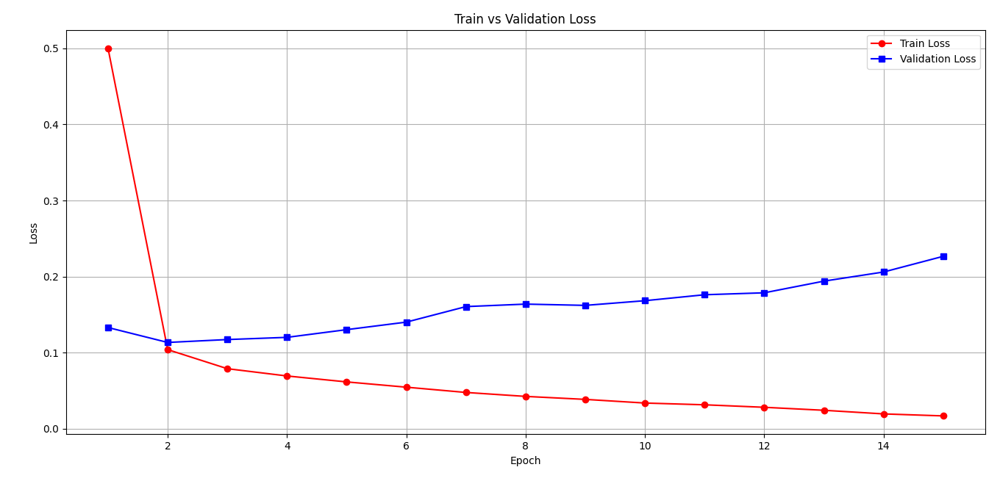

# Tweets Sentiment Detection with Pytorch


El objetivo de este proyecto será implementar la librería `PyTorch` para resolver el problema propuesto por el siguiente [dataset](https://www.kaggle.com/datasets/tariqsays/sentiment-dataset-with-1-million-tweets/data).


Se implementará una red neuronal con arquitectura tipo MLP.

Además, se implementarán técnicas avanzadas para la mejora del rendimiento del modelo, entre estas: Learning Rate Scheduling, Hypertunning (con ray tune), Batch Normalization, He Initialization, Regularization (L1 o L2 con Dropout), etc.


# Visualización del Dataset

Usando el siguiente código cargamos el dataset y revisamos su estructura:

```python
import kagglehub
import pandas as pd

# Download latest version
path = kagglehub.dataset_download("tariqsays/sentiment-dataset-with-1-million-tweets")
x = pd.DataFrame(pd.read_csv(path + "/dataset.csv"))
print(x.shape)
print(x.iloc[0])

```

Resultado:

```python
(937854, 3)
Text        @Charlie_Corley @Kristine1G @amyklobuchar @Sty...
Language                                                   en
Label                                               litigious
Name: 0, dtype: object
```

El dataset base contiene 937.854 registros, donde cada registro cuenta con 3 características: Text, Language y Label.

Es importante destacar que existen 4 etiquetas: positive,negative,uncertainty,litigious.
Es importante ademas destacar que la frecuencia de aparicion de idiomas es asi:

```
en : 93%
fr : 1%
Other (53453) : 6%
```

Es importante destacar que se comprobo que las clases estuvieran relativamente balanceadas:

```
positive : 28.21%
negative : 27.96%
uncertainty : 22.07%
litigious : 21.77%
```


Esto lo tomaremos en cuenta para transformar el texto.

# Preprocesamiento

Primeramente dividimos el dataframe basico verticalmente para obtener dos dataframes : uno con una sola columna (las etiquetas) y otro con dos columnas (para cada fila, el texto y su lenguaje).

Luego creamos las funciones convert_base_X y clean_text para convertir el Dataframe de texto + lenguaje en un arreglo de numpy donde para cada posicion se tuviera el texto con el lenguaje y el texto base limpiado. Este es el codigo.


```python

# main.py

from utils.convert_base_X import convert_base_X
from utils.load_base_data import load_base_data

print("Cargando datos base")
base_dataset = load_base_data()
X = base_dataset.drop(labels=['Label'], axis=1)
Y = base_dataset['Label'].to_numpy()

print("Convirtiendo X base")
X = convert_base_X(X)

print("Generando corpus")
corpus = set([w.strip().lower() for w in " ".join(X).split(" ")])

print(corpus)
print(len(corpus))
```

```python

# utils/load_base_data.py

import kagglehub
import pandas as pd

def load_base_data():
    # Download latest version
    path = kagglehub.dataset_download("tariqsays/sentiment-dataset-with-1-million-tweets")
    base_dataset = pd.DataFrame(pd.read_csv(path + "/dataset.csv"))
    return base_dataset

```

```python

# utils/convert_base_X
import numpy as np
from .clean_text import clean_text

def convert_base_X(X, SUPPORTED_LAN=["en", "fr"]):
    """
        Recibe el dataframe basico cargado que contiene ~1M de registros
        con dos columnas : "Text" y "Language" y las combina para
        crear un dataframe con solo registros de texto.

        Ademas, elimina palabras eliminables de los textos llamando a la funcion
        clean_text.
    """
    def process_row(row):
        print(f"\t{row.name}/{len(X)}", end="\r")
        lan_tag = "lan_" + (row.Language if row.Language in SUPPORTED_LAN else "other")
        new_row = lan_tag + " " + clean_text(row.Text, row.Language)
        return new_row
    return X.apply(process_row, axis=1).values


```

```python
# utils/clean_text.py

import re
from nltk.stem import LancasterStemmer, SnowballStemmer
import emoji
import string

language_map = {
    "el": "greek",
    "pt": "portuguese",
    "ca": "catalan",
    "tl": "tagalog",
    "da": "danish",
    "hu": "hungarian",
    "ht": "haitian creole",
    "fr": "french",
    "qht": "haitian creole (Twitter-specific)",
    "is": "icelandic",
    "th": "thai",
    "pa": "punjabi",
    "am": "amharic",
    "und": "undetermined",
    "qst": "spanish (Twitter-specific)",
    "bn": "bengali",
    "en": "english",
    "cs": "czech",
    "sl": "slovene",
    "ro": "romanian",
    "eu": "basque",
    "vi": "vietnamese",
    "fi": "finnish",
    "ur": "urdu",
    "sv": "swedish",
    "cy": "welsh",
    "nl": "dutch",
    "qme": "meitei (Twitter-specific)",
    "it": "italian",
    "iw": "hebrew",  # Deprecated, use 'he' in modern standards
    "ta": "tamil",
    "zh": "chinese",
    "es": "spanish",
    "ne": "nepali",
    "sr": "serbian",
    "sd": "sindhi",
    "fa": "persian",
    "lt": "lithuanian",
    "et": "estonian",
    "in": "indonesian",  # Deprecated, use 'id' in modern standards
    "ja": "japanese",
    "tr": "turkish",
    "ar": "arabic",
    "ru": "russian",
    "ko": "korean",
    "de": "german",
    "zxx": "no linguistic content",
    "ckb": "central kurdish",
    "qam": "armenian (Twitter-specific)",
    "ml": "malayalam",
    "no": "norwegian",
    "pl": "polish",
    "lv": "latvian",
    "art": "artificial language",
    "bg": "bulgarian",
    "or": "oriya",
    "uk": "ukrainian",
    "mr": "marathi",
    "hi": "hindi",
    "te": "telugu",
    "si": "sinhala",
    "kn": "kannada",
    "gu": "gujarati"
}


def clean_text(text, lan) -> str:
    """
        Elimina emojis, @s y urls del texto.
    """

    # precompilar los patrones y los steemers
    text = text.strip()
    text = text.replace('\n', ' ').replace('\t', ' ')
    text = text.translate(str.maketrans('', '', string.punctuation))
    text = emoji.replace_emoji(text, replace="")
    text = re.sub(r'(@\w+|http\S+|#\w+)', '', text)
    text = re.sub(r'\b\w*\d\w*\b', '', text)
    try:
        if type(lan) == str and 'http' not in lan:
            if lan == "en":
                steemer = LancasterStemmer()
            else:
                steemer = SnowballStemmer(language_map[lan])
            text = " ".join([steemer.stem(w).lower() for w in text.split(" ")])
    except:
        pass
    finally:
        return text


```

Con el codigo actual, la longitud del corpus es de ~750.000 palabras, demasiado grande. Buscaremos reducirlo aun mas y optimizar el codigo.


## Mejora del codigo

1- Se creo el modulo constants.py para almacenar alli las constantes del proyecto.

2- Se precompilaron las expresiones regulares, steemers y stopwords_dicts y se almacenaron en constants.

3- Se limpio el codigo de clean_text.py

## Implementacion de filtrado por frecuencia

Cree la funcion `generate_corpus()` para generar un corpus de aquellas palabras que aparcen mas de N cantidad de veces, con ello, la dimension del corpus se redujo en un 90%.

```python

from .constants import MIN_APP_FREC
import numpy as np
import pandas as pd
def generate_corpus(X):
    """
        Recibe la lista de tweets limpios y retorna el corpus.
    """
    app_dict = {}
    for tw in X:
        print(tw)
        for w in tw.split(" "):
            if app_dict.get(w):
                app_dict[w] += 1
            else:
                app_dict[w] = 1
    return np.array([w for w in app_dict.keys() if app_dict[w] >= MIN_APP_FREC])
```

## Implementacion de persistencia de tweets procesados

Luego de multiples pruebas con la funcion `convert_base_X`, empezamos a implementar persistencia de tweets procesador para perder menos tiempo.

Por otro lado, se implemento la division del conjunto de datos previo a al vectorizacion a traves de `CountVectorizer`.

```python

# main.py

from sklearn.model_selection import train_test_split
from utils.convert_base_X import convert_base_X
from utils.load_base_data import load_base_data
import os
from utils.constants import *
import pandas as pd

from utils.show_dataset_info import show_dataset_info


base_dataset = None
if os.path.exists(f"./{PROCESSED_DATA_FILENAME}"):
    base_dataset = pd.read_csv(f"./{PROCESSED_DATA_FILENAME}")
else:
    base_dataset = load_base_data()
    X = base_dataset.drop(labels=['Label'], axis=1)
    Y = base_dataset['Label'].to_numpy()
    X = convert_base_X(X)
    base_dataset = pd.DataFrame({"tweets" : pd.Series(X), "target":pd.Series(Y) })
    base_dataset.to_csv(f"./{PROCESSED_DATA_FILENAME}",index=False)

X = base_dataset["tweets"]
Y = base_dataset['target']

X_train, X_val, Y_train, Y_val = train_test_split(X, Y, random_state=42, test_size=0.1, stratify=Y)
X_train, X_test, Y_train, Y_test = train_test_split(X_train, Y_train, random_state=42, test_size=0.1, stratify=Y_train)

show_dataset_info(X_train, Y_train, "Train")
show_dataset_info(X_val, Y_val, "Val")
show_dataset_info(X_test, Y_test, "Test")
```

```
~~~~~~~~ Dataset : Train
Shape del X : (759661,)
Shape del Y : (759661,)
Distribucion de target
positive   :   28.21
negative   :   27.96
uncertainty   :   22.07
litigious   :   21.77
~~~~~~~~ Dataset : Val
Shape del X : (93786,)
Shape del Y : (93786,)
Distribucion de target
positive   :   28.21
negative   :   27.96
uncertainty   :   22.07
litigious   :   21.77
~~~~~~~~ Dataset : Test
Shape del X : (84407,)
Shape del Y : (84407,)
Distribucion de target
positive   :   28.21
negative   :   27.96
uncertainty   :   22.07
litigious   :   21.77
```

## Implementacion de vectorizacion con CountVectorizer

1- Se implemento CountVectorizer para vectorizacion: con ello nos ahorramos el problema de la generacion del corpus y del enorme espacio que conllevaba generar los embeddings manualmente. Es destacable mencionar que CountVectorizer funciona infinitamente mejor por que implementa el concepto de Sparse Matrix, una estructura de datos que se utiliza para almacenar informacion asociada a una matriz con muchos 0s. La matriz de dispersion solo almacena informacion de las coordenadas donde se almacenan los valores distintos de 0.

Ejm:

Matriz densa : [1,0,0,3,0,1]
Matriz dispersa : (0,1), (4,3), (6,1)

Las matrices dispersas ocupan infinitamente menos espacio.

2- Luego, para crear los dataloaders se tuvieron que convertir las matrices de dispersion a tensores de pytorch, para ello creamos la funcion `convert_sparse_to_torch`.

3- Luego se utilizo one hot encoding para convertir los tags.

```python
import torch
from utils.convert_to_sparse_tensor import convert_to_sparse_tensor
from torch.utils.data import TensorDataset
from sklearn.model_selection import train_test_split
from sklearn.feature_extraction.text import CountVectorizer
from utils.convert_base_X import convert_base_X
from utils.load_base_data import load_base_data
import os
from utils.constants import *
import pandas as pd
from torch.utils.data import DataLoader
import torch
from sklearn.feature_extraction.text import CountVectorizer

base_dataset = None

if os.path.exists(f"./{PROCESSED_DATA_FILENAME}"):
    base_dataset = pd.read_csv(f"./{PROCESSED_DATA_FILENAME}")
else:
    base_dataset = load_base_data()
    X = base_dataset.drop(labels=['Label'], axis=1)
    Y = base_dataset['Label'].to_numpy()
    X = convert_base_X(X)
    base_dataset = pd.DataFrame({"tweets" : pd.Series(X), "target":pd.Series(Y) })
    base_dataset.to_csv(f"./{PROCESSED_DATA_FILENAME}",index=False)

X = base_dataset["tweets"]
Y = base_dataset['target'].map(TAGS_MAP)

X_train, X_val, Y_train, Y_val = train_test_split(X, Y, random_state=42, test_size=0.1, stratify=Y)
X_train, X_test, Y_train, Y_test = train_test_split(X_train, Y_train, random_state=42, test_size=0.1, stratify=Y_train)

# Solo se admitiran palabras en el corpus que aparezcan +5 veces
vectorizer = CountVectorizer(min_df=5)

X_train = convert_to_sparse_tensor(vectorizer.fit_transform(X_train))
X_val = convert_to_sparse_tensor(vectorizer.transform(X_val))
X_test = convert_to_sparse_tensor(vectorizer.transform(X_test))

Y_train = torch.tensor(Y_train.to_numpy()).unsqueeze(1)
Y_val = torch.tensor(Y_val.to_numpy()).unsqueeze(1)
Y_test = torch.tensor(Y_test.to_numpy()).unsqueeze(1)

print(X_train.shape)
print(Y_train.shape)
print(X_val.shape)
print(Y_val.shape)
print(X_test.shape)
print(Y_test.shape)


train_dataloader = DataLoader(TensorDataset(X_train, Y_train), batch_size=BATCH_SIZE, shuffle=False)
validation_dataloader = DataLoader(TensorDataset(X_val, Y_val), batch_size=BATCH_SIZE, shuffle=False)
test_dataloader = DataLoader(TensorDataset(X_test, Y_test), batch_size=BATCH_SIZE, shuffle=False)

```


```

# train set
torch.Size([759661, 63517])
torch.Size([759661, 1])

# val set
torch.Size([93786, 63517])
torch.Size([93786, 1])

# test set
torch.Size([84407, 63517])
torch.Size([84407, 1])
```

# Creacion de arquitectura

La forma basica de MLP creado (en principio) es:


```python

import torch


class MLP(torch.nn.Module):
    def __init__(self, hidden_sizes, input_shape, out_size):
        super(MLP,self).__init__()
        self.layers = torch.nn.ModuleList()

        current_size = input_shape
        for layer in hidden_sizes:
            self.layers.append(torch.nn.Linear(current_size, layer))
            self.layers.append(torch.nn.ReLU())
            # normalizacion
            # dropout
            current_size = layer

        self.layers.append(torch.nn.Linear(current_size, out_size))

    def forward(self, X):
        out = X
        for layer in self.layers:
            out = layer(out)
        return out

    def _init_weights(self):
        pass
```


# Primer intento de entrenamiento

Codigo:

```python

from logging import critical
from sklearn.model_selection import train_test_split
from utils.constants import BATCH_SIZE
from utils.get_preprocessed_data import get_preprocessed_data
import torch
from utils.MLP import MLP
from utils.generate_dataloaders import generate_dataloaders

if __name__ == "__main__":
    (X_train, Y_train), (X_val, Y_val), (X_test, Y_test) = get_preprocessed_data()
    train_dataloader, validation_dataloader,_= generate_dataloaders(
            train_dataset=(X_train, Y_train),
            val_dataset=(X_val, Y_val),
            BATCH_SIZE=128
            )
    mlp = MLP(
            input_shape=X_train.shape[1],
            hidden_sizes=[300,300,300], 
            out_size=4).to("cuda")
    criterion = torch.nn.CrossEntropyLoss()
    optimizer = torch.optim.Adam(params=mlp.parameters(), lr=1e-4)
    for i in range(100):
        for (X_batch, Y_batch) in train_dataloader:
            X_batch = X_batch.float().to("cuda")
            Y_batch = Y_batch.to("cuda")
            optimizer.zero_grad()

            output = mlp(X_batch)
            loss = criterion(output, Y_batch)

            loss.backward()
            optimizer.step()

            print(loss.item())

```

A pesar de que el entrenamiento corre bien, es extremadamente lento. Por lo visto, esto se debe al siguiente pedazo de codigo:

```python
from torch.utils.data import DataLoader
from utils.constants import *
from torch.utils.data import TensorDataset
import torch

def sparse_collate_fn(batch):
    X_batch, Y_batch = zip(*batch)
    return torch.stack([x.to_dense() for x in X_batch]), torch.stack(Y_batch)


def generate_dataloaders(BATCH_SIZE,train_dataset=None, val_dataset=None, test_dataset=None):
    train_dataloader, validation_dataloader, test_dataloader = None, None, None
    if train_dataset:
        train_dataloader = DataLoader(
                TensorDataset(train_dataset[0], train_dataset[1]), 
                batch_size=BATCH_SIZE, 
                shuffle=False, 
                collate_fn=sparse_collate_fn)
    if val_dataset:
        validation_dataloader = DataLoader(
                TensorDataset(val_dataset[0], val_dataset[1]), 
                batch_size=BATCH_SIZE, 
                shuffle=False, 
                collate_fn=sparse_collate_fn)

    if test_dataset:
        test_dataloader = DataLoader(
                TensorDataset(test_dataset[0], test_dataset[1]), 
                batch_size=BATCH_SIZE, 
                shuffle=False, 
                collate_fn=sparse_collate_fn)
    return train_dataloader, validation_dataloader, test_dataloader

```

El `x.to_dense()` corre en la cpu, lo cual relentiza muchisimo el entrenamiento. Una alternativa a esto es lo siguiente:

(En `get_preprocessed_data`)

```python

    X_train = convert_to_sparse_tensor(vectorizer.fit_transform(X_train)).to("cuda")
```

El `.to("cuda")` para todo el `X_train` a la GPU, y eso hace que el `.to_dense` corra en la GPU, sin embargo no es la mejor forma.

## Modificacion de plan de transformacion de tweets

Despues de bastante investigacion nos dimos cuenta de que hay muchas maneras diferentes de preprocesar los tweets y que la forma mas optima para este caso la averiguaremos seguramente mas adelante en nuestra carrera cuando tengamos mas experiencia. Por ahora, sabemos que existe una forma mucho mas optima de afrontar este caso (aunque quiza no la mejor) que es usando Tokenizers. Basicamente transformando las palabras en un conjunto de tokens (numeros) y usando una capa de Embeddings (`nn.Embeddings`).

La capa de word embedding (`nn.Embeddings`) recibe las cadenas de texto en forma de tokens, lo que hice para tokenizar fue lo siguiente:

```python

# main.py
if __name__ == "__main__":
    (X_train, Y_train), (X_val, Y_val), (X_test, Y_test) = get_preprocessed_data()

    tokenizer = Tokenizer(models.BPE(unk_token="[UNK]"))
    trainer = trainers.BpeTrainer()
    tokenizer.train_from_iterator(X_train,trainer=trainer)

    train_dataloader, validation_dataloader,_= generate_dataloaders(
            train_dataset=(X_train, Y_train),
            val_dataset=(X_val, Y_val),
            tokenizer=tokenizer
            )

    ...
```

```python

# utils/generate_dataloaders

from torch.utils.data import DataLoader
from utils.constants import *
from torch.utils.data import TensorDataset
from utils.TweetDataset import TweetDataset
import torch
from utils.constants  import BATCH_SIZE

def generate_dataloaders(tokenizer,train_dataset=None, val_dataset=None, test_dataset=None):
    dataloaders = []
    for dataset in [train_dataset, val_dataset, test_dataset]:
        new_dataloder = None
        if dataset:
            new_dataloder = DataLoader(
                    TweetDataset(tweets=dataset[0], labels=dataset[1], tokenizer=tokenizer), 
                    batch_size=BATCH_SIZE, 
                    shuffle=False)
        dataloaders.append(new_dataloder)
    return dataloaders

```

```python

# utils/TweetDataset

import torch
from torch.utils.data import Dataset
from utils.encode_text import encode_text
from utils.constants import MAX_LEN


class TweetDataset(Dataset):

    def __init__(self, tweets, labels, tokenizer):
        self.tweets = tweets
        self.labels = labels
        self.tokenizer = tokenizer

    def __len__(self):
        return len(self.tweets)

    def __getitem__(self, idx):
        text = self.tweets[idx]
        label = self.labels[idx]
        tokens = encode_text(text,self.tokenizer, MAX_LEN)
        tokens = tokens + [0] * (MAX_LEN - len(tokens)) # padding
        return torch.tensor(tokens), torch.tensor(label)
```

En resumen, los dataloaders cargan los tweets 'crudos' y cuando se genera el batch es que se tokenizan + padding. Luego cada tweet es transformado en un vector de `MAX_LEN` posiciones. Por lo tanto a la red llega un batch de `(BATCH_SIZE, MAX_LEN)`.

Esta termino siendo la arquitectura del MLP.

```python
import torch
from utils.constants import VOCAB_SIZE


class MLP(torch.nn.Module):
    def __init__(self, embed_dim, hidden_sizes, out_size):
        super(MLP,self).__init__()
        self.layers = torch.nn.ModuleList()

        self.embed = torch.nn.Embedding(VOCAB_SIZE, embed_dim,padding_idx=0)
        current_size = embed_dim
        for layer in hidden_sizes:
            self.layers.append(torch.nn.Linear(current_size, layer))
            self.layers.append(torch.nn.ReLU())
            # normalizacion
            # dropout
            current_size = layer

        self.layers.append(torch.nn.Linear(current_size, out_size))

    def forward(self, X):
        out = self.embed(X) # (batch, seq, embed)
        masked = out * (X != 0).unsqueeze(-1).float() 
        pooled = masked.mean(dim=1) # (batch, embed)
        out = pooled
        for layer in self.layers:
            out = layer(out)
        return out

    def _init_weights(self):
        pass
```

Se pasan los vectores de tokens por la capa de embeddings para convertir cada vector (tweet tokenizado) en una matriz de `(MAX_LEN, EMBED_DIM)`. El funcionamiento especifico del word embedding es algo que ignoramos por los momentos, lo aprenderemos con exactitud en un futuro muy cercano. Luego se aplanan las matrices y pasan por un proceso de `Mean Pooling`.


## 1er entrenamiento estable

Luego de implementar finalmente las tecnicas mencionadas anteriormente, se implementaron tambien dos tenicas mas : paralelizacion en generacion de batches con `num_workers`, automatic mixed precision.

Estas dos tecnicas en conjunto redujeron el tiempo de procesamiento de epocas en un 66%.

Ademas de esto, implementamos `matplotlib` para revisar el overfitting a lo largo de las epocas, este fue el resultado para un entrenamiento de 15 epocas.

```
Epoch : 14
Train loss : 0.017
Val loss : 0.226
Val accuracy : 0.955
Overfitting : -1233.523
Tiempo de procesamiento de la epoca : 12.035
```


Codigo destacable:

```python

# main.py

import numpy as np
from utils.constants import BATCH_SIZE
from utils.get_preprocessed_data import get_preprocessed_data
import torch
from utils.MLP import MLP
from utils.generate_dataloaders import generate_dataloaders
from utils.initialize_tokenizer import initialize_tokenizer
import time

from utils.plot_model_performance import plot_model_performance

if __name__ == "__main__":
    (X_train, Y_train), (X_val, Y_val), (X_test, Y_test) = get_preprocessed_data()

    tokenizer = initialize_tokenizer(X_train)

    train_dataloader, validation_dataloader,_= generate_dataloaders(
            train_dataset=(X_train, Y_train),
            val_dataset=(X_val, Y_val),
            tokenizer=tokenizer
            )
    mlp = MLP(embed_dim=256,hidden_sizes=[300,300,300],out_size=4).to("cuda")
    criterion = torch.nn.CrossEntropyLoss()
    optimizer = torch.optim.Adam(params=mlp.parameters(), lr=5e-3)
    scaler = torch.amp.GradScaler()
    epochs_train_loss = []
    epochs_val_loss = []
    for i in range(15):
        t1 = time.time()
        print(f"Epoch : {i}")
        train_loss = []
        val_loss = []
        val_accuracy = []

        mlp.train()
        for i, (X_batch, Y_batch) in enumerate(train_dataloader):
            print(f"Batch : {i}/{len(X_train)//BATCH_SIZE}", end="\r") 
            X_batch, Y_batch = X_batch.to('cuda'), Y_batch.to('cuda')
            optimizer.zero_grad()

            with torch.amp.autocast(device_type='cuda'):
                output = mlp(X_batch)
                loss = criterion(output, Y_batch)

            scaler.scale(loss).backward()
            scaler.step(optimizer)
            scaler.update()

            train_loss.append(loss.item())


        mlp.eval()

        with torch.no_grad():
            for i, (X_batch, Y_batch) in enumerate(validation_dataloader):
                print(f"Batch : {i}/{len(X_val)//BATCH_SIZE}", end="\r")
                X_batch, Y_batch = X_batch.to('cuda'), Y_batch.to('cuda')

                output = mlp(X_batch)
                loss = criterion(output, Y_batch)
                _, predicted = torch.max(output, 1)

                val_accuracy.append((Y_batch == predicted).cpu().sum()/BATCH_SIZE)
                val_loss.append(loss.item())

        epochs_train_loss.append(np.mean(train_loss))
        epochs_val_loss.append(np.mean(val_loss))
        print(f'Train loss : {np.mean(train_loss)}')
        print(f'Val loss : {np.mean(val_loss)}')
        print(f'Val accuracy : {np.mean(val_accuracy)}')
        print(f'Overfitting : {100 - (np.mean(val_loss)*100/np.mean(train_loss))}')
        print(f"Tiempo de procesamiento de la epoca : {time.time()-t1}")
        print("_______________")

    plot_model_performance(epochs_train_loss,epochs_val_loss)
```

```python

# utils/generate_dataloaders.py

from torch.utils.data import DataLoader
from utils.constants import *
from torch.utils.data import TensorDataset
from utils.TweetDataset import TweetDataset
import torch
from utils.constants  import BATCH_SIZE

def generate_dataloaders(tokenizer,train_dataset=None, val_dataset=None, test_dataset=None):
    dataloaders = []
    for dataset in [train_dataset, val_dataset, test_dataset]:
        new_dataloder = None
        if dataset:
            new_dataloder = DataLoader(
                    TweetDataset(tweets=dataset[0], labels=dataset[1], tokenizer=tokenizer), 
                    batch_size=BATCH_SIZE, 
                    shuffle=False,
                    num_workers=4,
                    pin_memory=True,
                    persistent_workers=True)
        dataloaders.append(new_dataloder)
    return dataloaders
```
